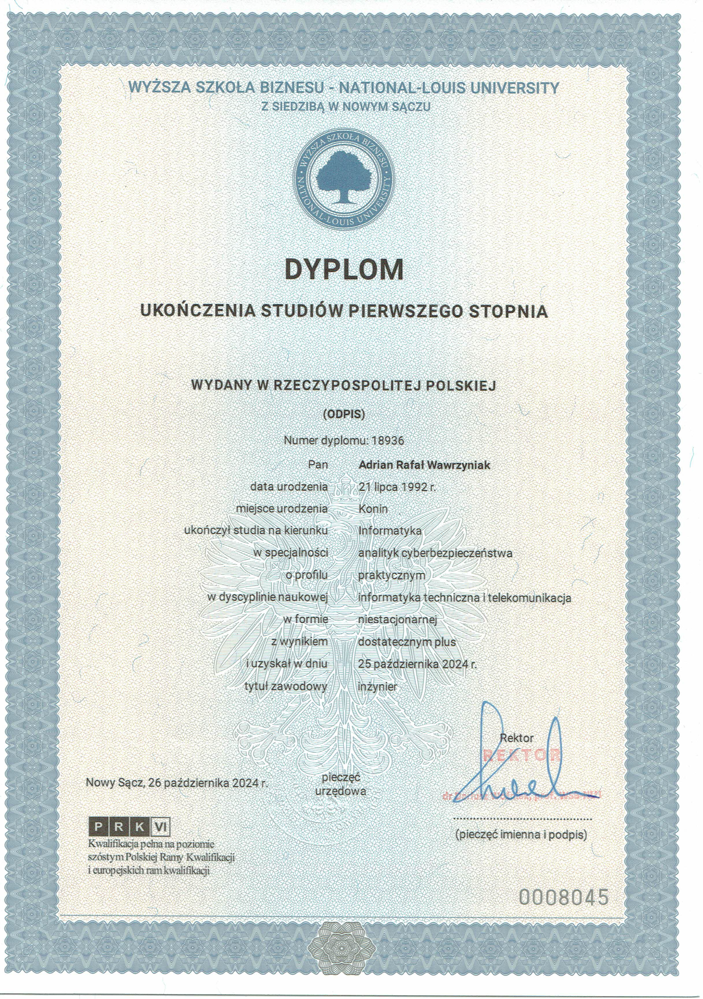

# 👋 Cześć, tutaj Adrian.

Jestem początkującym **programistą webowym**, który rozwija się w kierunku tworzenia aplikacji internetowych w Pythonie i JavaScript.

## 🎓 O mnie

Mam wykształcenie informatyczne:   
- studia inżynierskie z informatyki
- studia podyplomowe z zakresu front-end i back-end developmentu  
- technikum informatyczne  

Dodatkowo ukończyłem:
- Harvard CS50 – Web Programming with Python and JavaScript  
- certyfikat F100 – podstawy testowania manualnego i automatycznego oprogramowania  

## 🛠️ Technologie, z którymi pracuję

- HTML, CSS, JavaScript  
- Python  
- podstawy SQL  
- Git / GitHub  

## 🎯 Obecnie

Obecnie skupiam się na:
- rozwijaniu umiejętności programistycznych
- budowaniu projektów do portfolio
- przygotowani  

## 📂 Projekty

(w trakcie budowy 🚧)

# 📜 Moje certyfikaty i osiągnięcia edukacyjne w IT

